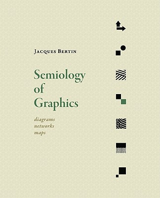
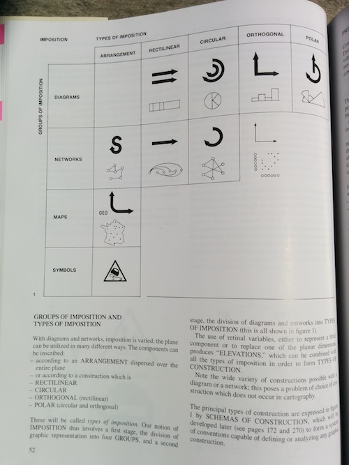
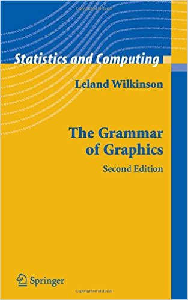
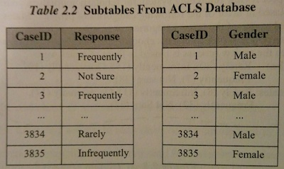
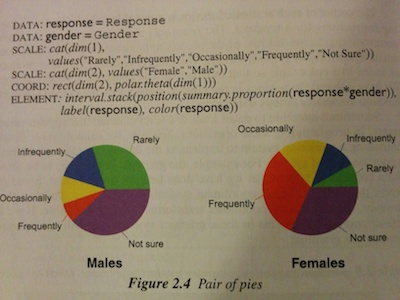
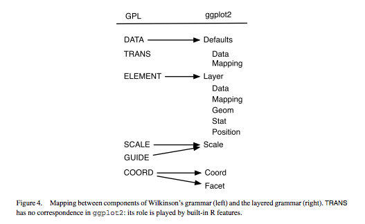

```{r load_ggplot, include = F}
library(ggplot2)
```
# Semiology of Graphics

## *Jacques Bertin, 1967*

 


## Retinal Values

<div class="half-grid">

</div>
<div class="half-grid">
  * Position
  * Size
  * Shape
  * Value
  * Color
  * Orientation
  * Texture
</div>

## Types of Imposition

<div class="half-grid">

</div>
<div class="half-grid">
  * Arrangement
  * Rectilinear
  * Circular
  * Orthogonal
  * Polar
</div>

# The Grammar of Graphics

## *Leland Wilkinson, 1999*

 


## Why a grammar?

> If we endeavor to develop a charting instead of a graphing program, we will accomplish two things. First, we inevitably will offer fewer charts than people want. Second, our package will have no deep structure. Our computer program will be unnecessarily complex, because **we will fail to reuse objects or routines that function similarly in different charts**. And we will have **no way to add new charts to our system without generating complex new code**. Elegant design requires us to think about a theory of graphics, not charts.

## Pie


## How do we transform data to graphics?

 


# A Layered Grammar of Graphics

## *Hadley Wickham, begun in 2006*


## A layered grammar



## The essence of a graphic

* the **data**
* the **mapping** of that **data** to **aes**thetic properties
* the visual display of that data as **geom**etric elements

## Basic plot

```{r basic_plot}
ggplot(
    data = mpg,
    mapping = aes(x = cty, y = hwy, color = factor(cyl))
  ) +
  geom_point()
```

## Layers enable more complex plots

These elements form a layer:

  * **data**
  * how data get mapped to **aes**thetic properties such as x, y, color, shape, and size
  * what **geom**etric element is representing the data
  * any necessary **stat**istical operations, such as count for bar charts
  * how the data points are **position**ed

## Layered plot

```{r layered_plot}
ggplot(data = mpg,  mapping = aes(x = cty, y = hwy, col = factor(cyl))) +
  geom_point() +
  geom_abline(slope = 1, intercept = 0, color = 'black', linetype = 'dotted')
```


## Additional properties of the plot for flexibility

  * **scale**s
  * **coord**inates
  * **facet**s

## The possibilities are endless

```{r complex_plot}
ggplot(data = mpg,  mapping = aes(x = cty, y = hwy, col = factor(cyl))) +
  geom_point() +
  geom_abline(slope = 1, intercept = 0, color = 'black', linetype = 'dotted') +
  scale_color_manual(name = '# of Cyl', values = c('skyblue','royalblue', 'blue', 'navy')) +
  coord_fixed(ratio = 1) +
  facet_grid(.~class)
```


# [Let's get coding](./workshop.nb)
