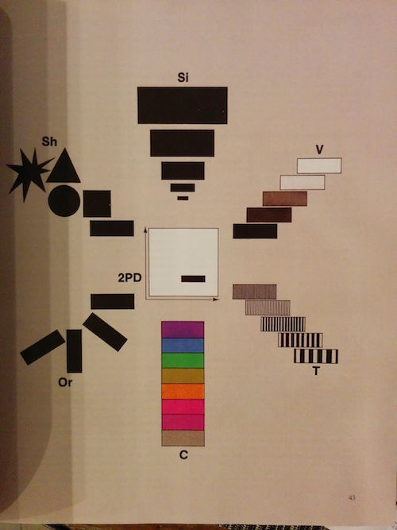
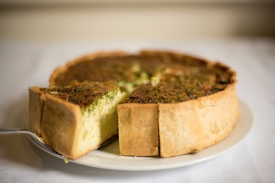
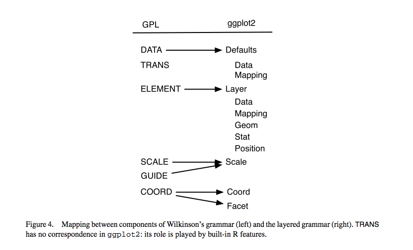

# Semiology of Graphics

## *Jacques Bertin, 1967*

## Retinal Values

"Retinal values" include:

  * Position
  * Size
  * Shape
  * Value
  * Color
  * Orientation
  * Texture

## Types of Imposition

"Types of imposition" include:

  * Arrangement
  * Rectilinear
  * Circular
  * Orthogonal
  * Polar

# The Grammar of Graphics

## *Leland Wilkinson, 1999*

## Why a grammar?

> If we endeavor to develop a charting instead of a graphing program, we will accomplish two things. First, we inevitably will offer fewer charts than people want. Second, our package will have no deep structure. Our computer program will be unnecessarily complex, because **we will fail to reuse objects or routines that function similarly in different charts**. And we will have **no way to add new charts to our system without generating complex new code**. Elegant design requires us to think about a theory of graphics, not charts.

## Pie

## How do we specify data to become graphics?

# A Layered Grammar of Graphics

## *Hadley Wickham, begun in 2006*

## A layered grammar

## The essence of a graphic

  * **data**
  * how data get mapped to **aes**thetic properties such as position, color, and size
  * what **geom**etric shape is representing the data
  * any necessary **stat**istical operations, such as count for bar charts
  * how the data points are **position**ed

# [Let's get coding](https://houstonusers.github.io/intro-to-ggplot2/workshop.nb)
